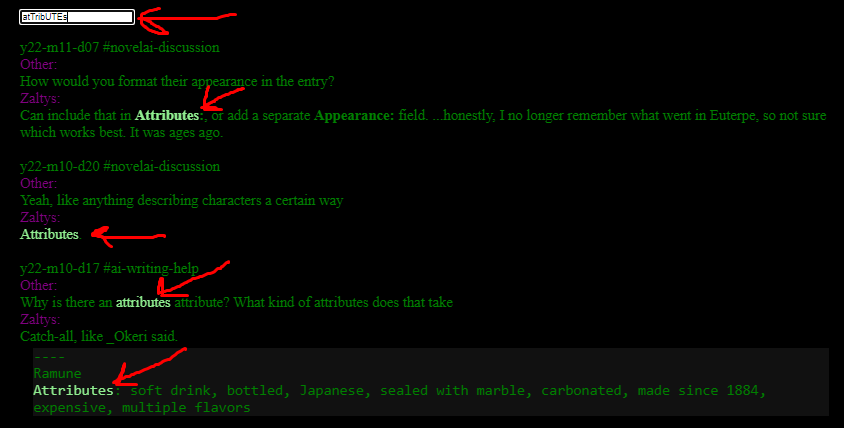
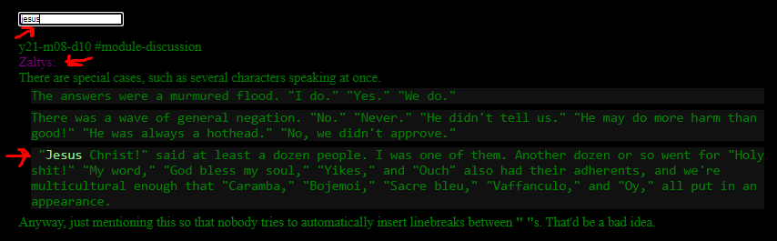

# AtillaYasar.github.io

last major update (as of nov 18th)  
2 sites to search from:  
- "who the heck is zaltys" ? come to the NovelAI discord and find out.
- zaltys-replies.html and zaltys-all.html  
- both sites have 13 channels worth of zaltys posts  
- zaltys-replies.html has his replies to other people, including the other person's post he replied to  
- zaltys-all.html has all his posts  
- layout:  
- "Other" and "Zaltys" are purple  
- first occurrence of search term in found posts is light green (main text is green)  
- text within ``` is in blockquotes and, pre, and has a lighter background color (#111 as opposed to #000), to resemble Discord's effect  
- text within ~~ has strikethrough (del)  
- text within ` is bolded  

screenshots from pages, searching "replies" for "attributes" (with weird capitalization to show case insensitivity), and "all" for "jesus"




image pages cleanup:
- deleted all of them. they suck.

showfragments.html
- do "copy to clipboard" on nai, poste the resulting json in the text are and write gimme to get the fragments of text from the entire history
